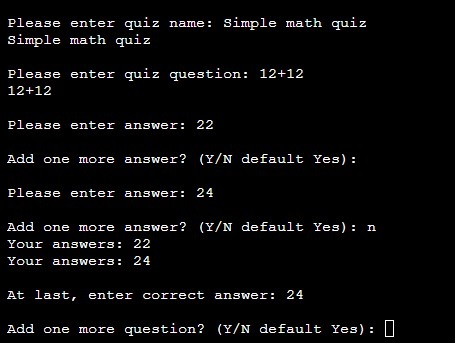

# Create or play quiz
#### [View the live project here](https://create-your-quiz.herokuapp.com/)

With this command-line application you can create your own quiz and let others play it. Challenge your friends and see who gets the best score on the questions you create. Or challenge yourself by playing a quiz created by a friend or stranger.

## UX User experience
The user himself chooses how many questions he wants to create and how many answer options there should be for each question. It is also possible to choose different numbers of answers to different questions. To make it easier for the user, for each question and answer they fill in, they are asked if they want to create one more question/answer, instead of having to decide in advance how many questions and answers they want to create.

## Features
### Choose to create or play a quiz
The Quiz app allows the user to choose whether to create a quiz or play a quiz.
It is fine to answer with both uppercase and lowercase letters. If the user accidentally fills in blanks, these will be ignored. In case of an incorrect answer, the user will, once again, be asked what they want to choose.
## 

### Create a quiz
When the user chooses to create a quiz, the app will ask the user to write the first question. After that, it asks the user to write a response. For each answer the user writes, it will ask if the user wants to add another answer. When the user chooses not to add more answers, it will ask which of the answers was correct, and then ask if the user wants to add another question.
When the user no longer wants to add more questions, it will save the quiz to the json file.

If the user chooses a too short name for his quiz or an abbreviated question/answer, he will be asked again to make another attempt with a specified minimum number of letters.
If the user accidentally fills in blanks, either before or after or only, these will be ignored. In the case of an insufficient answer, the user will be asked to try again.
When the user specifies which answer is correct, the app will check that the answer is included in the list of answers, if it is not included, the user will be asked to make another attempt.
## 

###  Play a quiz
When the user chooses to play a quiz, the app will first ask which quiz the user wants to play and print a list of available quizzes to choose from.
In case of an insufficient answer, the user will be asked which quiz the user wants to play again. If the user accidentally fills in blanks, either before or after or only, these will be ignored.

Once the user has selected which quiz they want to play, the app will print the first question and the answer options to choose from. The user responds by typing the answer the user believes is correct into the terminal. An correct answer that is written exactly as in the answer options, including vowels and consonants, counts as a correct answer. The user can also copy and paste with the mouse if desired. If the user accidentally fills in blanks, either before or after answers, these will be ignored.

After the user has answered a question, the app will print the next question and answer options in the terminal until the quiz is complete. Finally, it will print how many score the user achieved.
## 

## Technologies
- Python
- JSON
- GitHub
- GitHub Pages
- Gitpod

## Testing
 CI Python Linter
## 

### **Manual testing**
|Command input     |Expected command response                |Results              |
|----------------|-------------------------------|-----------------------------|
|**Lode command-line application**                |Please choose c or p:         |Pass |
|           |     | |
|**Please choose c or p:**      |        | |
|- Enter blanks          |Asks again: Please choose c or p: |Pass |
|- Enter something else   |Asks again: Please choose c or p:    |Pass |
|- Enter C or c |Please enter quiz name: |Pass |
|- Enter P or p        |Choose which quiz to play.  |Pass |
|           |     | |
|**Please enter quiz name:**	     |			          | |
|- Enter blanks |Please enter a name that is at least 2 characters long.         |Pass |
|- Enter 1 character and blanks   |Please enter a name that is at least 2 characters long. |Pass |
|- Enter blanks and 1 character  |Please enter a name that is at least 2 characters long. |Pass |
|           |     | |
|**Please enter quiz question:** |          | |
|- Enter blanks |Please enter a question that is at least 3 characters long.      |Pass |
|- Enter 1 character and blanks |Please enter a question that is at least 2 characters long.|Pass |
|- Enter blanks and 1 character|Please enter a question that is at least 2 characters long.|Pass |
|- Enter  a valid question|Please enter answer:|Pass |
|           |     | |
|**Please enter answer:** |          | |
|- Enter blanks |Please enter an answer that is at least 1 character long.      |Pass |
|- Enter  a valid answer|Add one more answer?|Pass |
|           |     | |
|**Add one more answer? (Y/N default No):** |          | |
|- Enter blanks |Yes: Add one more answer? (Y/N default No):    |Pass |
|- Enter anything else or nothing |Prints out the previously written answers and , At last, enter correct answer:|Pass |
|           |     | |
|**At last, enter correct answer:**|          | |
|- Enter blanks or something not in previously answered list |At last, enter correct answer:   |Pass |
|- Enter correct answer or correct answer and blanks|Add one more question? (Y/N default No):|Pass|
|           |     | |
|**Add one more question? (Y/N default No):**|          | |
|- y or Y |Please enter quiz question:  |Pass |
|- Enter anything else or nothing| Quits game and saves quiz game to json file.|Pass|
|           |     | |
|**Please choose quiz to play: p** |          | |
|- Enter p or P |Prints out all quizzes to choose from.     |Pass |
|- Writhing answer not on list |Please choose quiz to play:|Pass |
|- Writhing answer in list, with or without extra blanks|Whit out first question and answers to choose from. Ask user to: Write your answer:|Pass |
|           |     | |
|**Write your answer:** |          | |
|- Putting in wrong answer |Loads next question.    |Pass |
|- Putting in right answer |Loads next question. And adds +1 to score.|Pass |
|- Putting in right answer + blank |Loads next question. And adds +1 to score.|Pass|
|- After answering last question in quiz|prints out : Your score is: X  And quits game.  |Pass |

## Deployment
 **How you set up GitHub** 
Create a [fork of the repository.](https://docs.github.com/en/get-started/quickstart/fork-a-repo#forking-a-repository)
**1. Log in to GitHub and go to repository: [LinnSilver/make-a-quiz-pj3](https://github.com/LinnSilver/make-a-quiz-pj3)**
2. Click button fork -Create a new fork.
3. Choose repository name.
4. Click Create fork.

Now you have a fork of the repository in your repository. To access code:
 
5. In your new repository:
6. Click green button: Code arrow down.
7. Choose: Create codespace on main - Code is opened in a web codespace.

After this, you do not have the files in the repository locally on your computer.
To save a copy locally on your computer:
 
9. On GitHub.com, navigate to your fork of the repository.
10. Above the list of files, click Code, Local.
11. Copy the URL for the repository.
12. Open Git Bash.
13. Change the current working directory to the location where you want the cloned directory.
14. Type  `git clone`, and then paste the URL you copied earlier.
15. Press Enter. Your local clone will be created.

It's important to commit and push correctly. Read more here:
- [How to Commit and push code from local file system to GitHub Pages.](https://docs.github.com/en/desktop/contributing-and-collaborating-using-github-desktop/making-changes-in-a-branch/committing-and-reviewing-changes-to-your-project)

After every change in the code, it's important to redo the test section. Go through:
- Python Linter
- Manual testing

 **How to set up Heroku** 
1.  Log in on Heroku.
2.  Click: Show next steps.
3.  Click: Create new app.
4.  Fill in App name and choose a region. Click: Create app.
5.  Under **Deploy,** choose Deployment method GitHub.
6.  **Search for a repository to connect to,**  choose repo name.
7.  Manual deploy click Deploy Branch.

## Credits
### Content
All content on this command-line application was written by the developer.

### Acknowledgments
Thank you to my mentor Brian Macharia. For all the advice and your competence and thoroughness.

